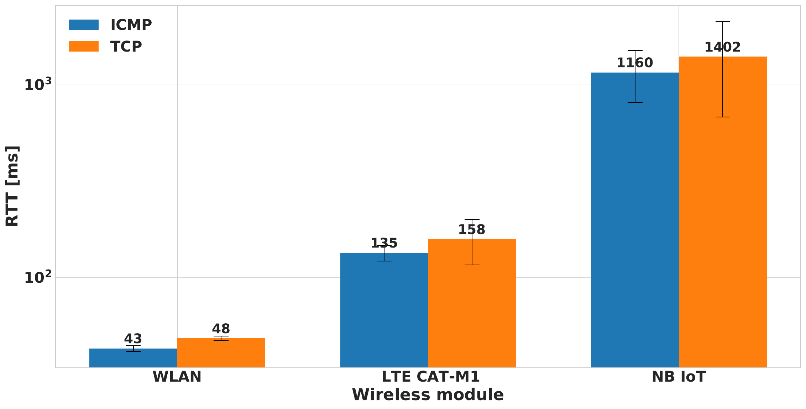

# IoT Protocol experiments

Backend scripts and FiPy software used to determine strong and weak sides of the following protocols: MQTT, HTTP, CoAP.

## Evaluation data

### Average RTT of ICMP protocol and TCP handshake cycle

### Average RTT of sending the information to the server

### Network layers distribution - submitting 31B payload to the server

### Network layers distribution - submitting 512B payload to the server

### Network layers distribution - submitting 1606B payload to the server

### Average RTT for getting the information from the server

### Network layers distribution - requesting 31B payload from the server

### Network layers distribution - requesting 512B payload from the server

### Network layers distribution - requesting 1606B payload from the server

